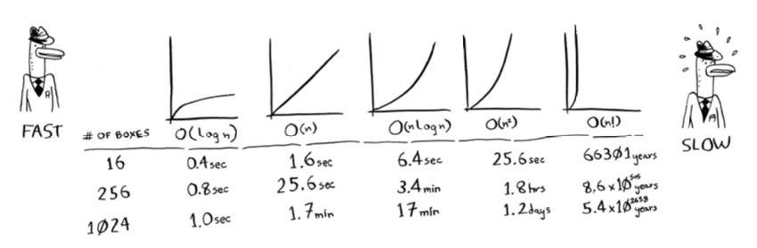

# Big O Notation
Big O Notation is special notation that tells you *how fast an algorithm is.*

Big O doesn't tell you the speed in seconds. Big O Notation lets you compare the number of operations. It tells you how fast an algorithm grows.

Big O Notation is about the ***worst-case*** scenario.

The main takeaways are as follows:
- Algorithms speed isn't measured in seconds, but in growth of the number of operations.
- Instead, we talk about how quickly the run time of an algorithm increases as the size of the input increases.
- Run time of algorithms is expressed in Big O notation.
- O(log n) is faster than O(n), but it gets a lot faster as the list of items you're searching grows.

# Some common Big O run times
Here are five Big O run times that you'll encountered a lot:
- O(log n), also known as log time. Example: *Binary Search*.
- O(n), also known as linear time. Example: *Simple Search*.
- O(n * log n). Example: A fast sorting algorithm, like *Quicksort*.
- O(n2). Example: A slow sorting algorithm, like *Selection Sort*.
- O(n!). Example: A really slow sorting algorithm, like the traveling salesperson.

##### Example

# Exercises
**1.3** You have a name and you want to find the person's phone number in the phone book. 
:arrow_right: ***O(log n)***

**1.4** You have a phone number and you want to find the person's name in the phone book. (Hint: You'll have to search through the whole book!)
:arrow_right: ***O(n)***

**1.5** You want to read the numbers of every person in the book.
:arrow_right: ***O(n)***

**1.6** You want to read the numbers of just the As.
:arrow_right: ***?***