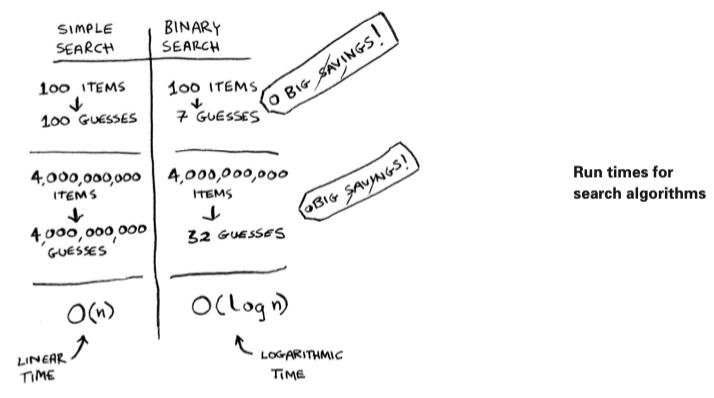

# Binary Search
Binary search is an algorithm; its input is ***a sorted list*** of elements. If an element you're looking for is in that list, binary search returns the ***position where it's located***. Otherwise, binary search returns ***null***.

In general, for any list of n, binary search will take log2(n) steps to run in the worst case, whereas simple search will take n steps.

*Note: Binary search only works when your list is in sorted order.*

# Running time
Any time I talk about an algorithm, I'll discuss its running time. Generally you want to choose the most efficient algorithm--whether you're trying to optimize for time or space.

Back to **binary search**. How much time do you save by using it? 

Well, the first approach was to check each number, one by one. If this is a list of 100 numbers, it takes up to 100 guesses. If it's a list of 4 billion numbers, it takes up to 4 billion guesses. So the maximum number of guesses is the same as the size of the list. This is called ***linear time***.
Binary search is different. If the list is 100 items long, it takes at most 7 guesses. If the list is 4 billion items, it takes at most 32 guesses. Binary search runs in ***logarithmic time*** (or log time).

# Exercises

**1.1** Suppose you have a sorted list of 128 names, and you're searching through it using binary search. What's the maximum number of steps it would take?

    log128 = 7
    7 is the maximum number of steps it would take to find.

**1.2** Suppose you double the size of the list. What's the maximum number of steps now?

    Now the size of the list should be 128*2 (256)
    And the maximum number of steps should be log256 = 8