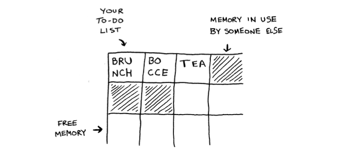
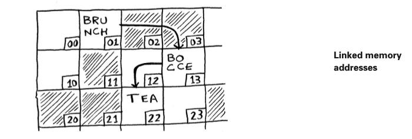
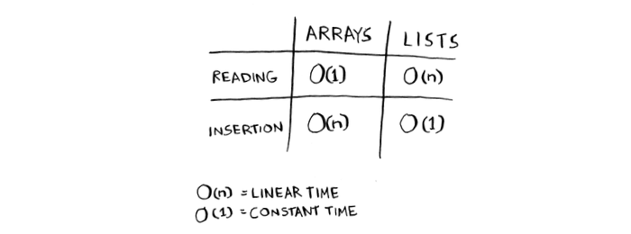
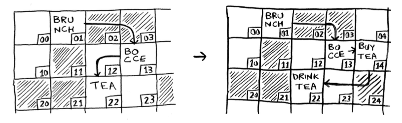
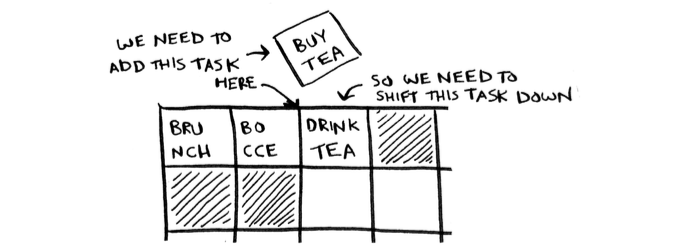
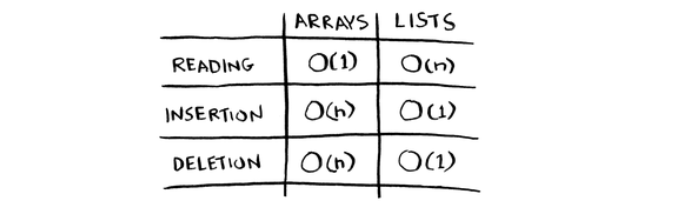
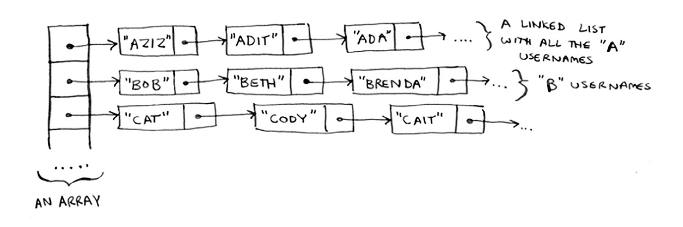

# Arrays and linked lists

Sometimes you need to store a list of elements in memory. Suppose you're writing an app to manage your todo. You'll want to store the todo as a list in memory.

*Should we use an array or a linked list?*

Let's store the todo in an array first.

**Using an array means all your tasks are stored contiguously (right next to each other) in memory.**

Now suppose you want to add a fourth task. But the next drawer is taken up by someone else's stuff.

So, that's when ***Linked List*** comes in.

# Linked List

*With linked list, your items can be anywhere in memory. Each item stores the address of the next item in the list. A bunch of random memory addresses are linked together.*

If **linked list** are so much better at inserts, what are **arrays** good for?

# Arrays

*Arrays are great if you want to read random elements, because you can look up any element in your array instantly.*

With a linked list, the elements aren't next to each other, so you can't instantly calculate the position of the fifth element in memory--you have to go the first element to get the address to the second element, then go to the second element to get the address to the third element, and so on until you get the the fifth element.

# Terminology

Use *index* to indicate the position of an element.

The run times for common operations on arrays and lists:

# Inserting into the middle of a list

Suppose you want your todo list to work more like a calendar. Earlier, you were adding things to the end of the list. Now you want to add them in the order in which they should be done.
*What's better if you want to insert elements in the middle: arrays or lists?*

With lists, it's as easy as changing the what the previous element points to.

But for arrays, you have to shift all the rest of the elements down. And if there's no space, you might have to copy everything to a new location!

:arrow_right: ***Lists are better if you want to insert elements in the middle.***

# Deletions

*What if you want to delete an element?*

Again, lists are better, because you just need to change what the previous element points to. With arrays, everything needs to be moved up when you delete an element.

Unlike insertions, deletions will always work. Insertions can fail sometimes when there's no space left in the memory. But you can always delete an element.

The run times for common operations on arrays and linked lists:

***So, which are used more?***

Obviously, it depends on the use case. But arrays see a lot of use because they allow random access.

There are two different types of access: ***random access*** and ***sequential access***.
- Sequential access means reading the elements one by one, starting at the first element.
- Random access means you can jump directly to the element that you want
  
Linked lists can *only* do sequential access. If you want to read the 10th element, you have to read the first 9 elements. Otherwise, with random access, you can just read the 10th element directly.

# Exercise

**2.1** 
Suppose you're building an app to keep track of your finances. Every day, you write down everything you spent money on.
At the end of the month, you review your expenses and sum up how much you spent. So you have lots of inserts and a few reads.
Should you use an array or a list?

:arrow_right: We should use a **list**, because we have lots of inserts and only have a few reads.

**2.2**
Suppose you're building an app for restaurants to take customers orders. Your app needs to store a list of orders. Servers keep adding orders to this list, and chefs take orders off the list and make them. It's an order queue: servers add orders to the back of the queue, and the chef takes the first order off the queue and cooks it.
Would you use an array or a linked list to implement this queue?

:arrow_right: We should use **list** to implement this. Because chefs should process these orders follow the order. So Linked List should do the job.

**2.3**
Let's run a thought experiment. Suppose Facebook keeps a list of usernames. When someone tries to log in to Facebook, a search is done for their username. If their name is in the list of usernames, they can log in. People log in to Facebook pretty often, so there are a lot of searches through this list of usernames. Suppose Facebook uses binary search to search the list. Binary search needs random access--you need to be able to get to the middle of the list of usernames instantly. Knowing this, would you implement the list as an array or a linked list?

:arrow_right: We need random access to the list of usernames so we use an **array** to store that list.

**2.4**

People sign up for Facebook pretty often, too. Suppose you decided to use an array to store the list of users. What are the downsides of an array for inserts? In particular, suppose you're using binary search to search for logins. What happens when you add new users to an array?

:arrow_right: ?

**2.5**
In reality, Facebook uses neither an array nor a linked list to store user information. Let's consider a hybrid data structure: an array of linked lists. You have an array with 26 slots. Each slot points to a linked list. For example, the first slot in the array points to a linked list containing all the usernames starting with a. The second slot points to a linked list containing all the usernames starting with b, and so on.

Suppose "Adit B" signs up for Facebook, and you want to add them to the list. You go to slot 1 in the array, go to the linked list for slot 1, and add Adit B at the end. Now, suppose you want to search for "Zac". You go to slot 26, which points to a linked list of all the Z names. Then you search through that list to find "Zac".

Compare this hybrid data structure to arrays and linked lists. Is it slower or faster than each for searching and inserting? You don't have to give Big O run times, just whether the new data structure would be faster or slower.